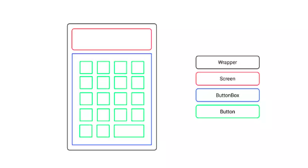
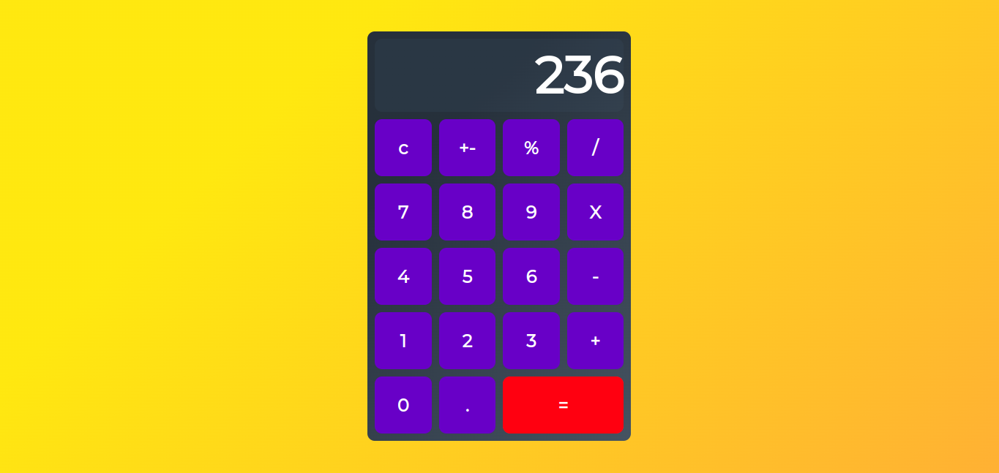

# React Calculator App

## The features we’ll implement include:

- add, subtract, multiply, divide
- support decimal values
- calculate percentages
- invert values
- reset functionality
- format larger numbers
- output resize based on length

## Figma Design Screenshot

## Final Result

